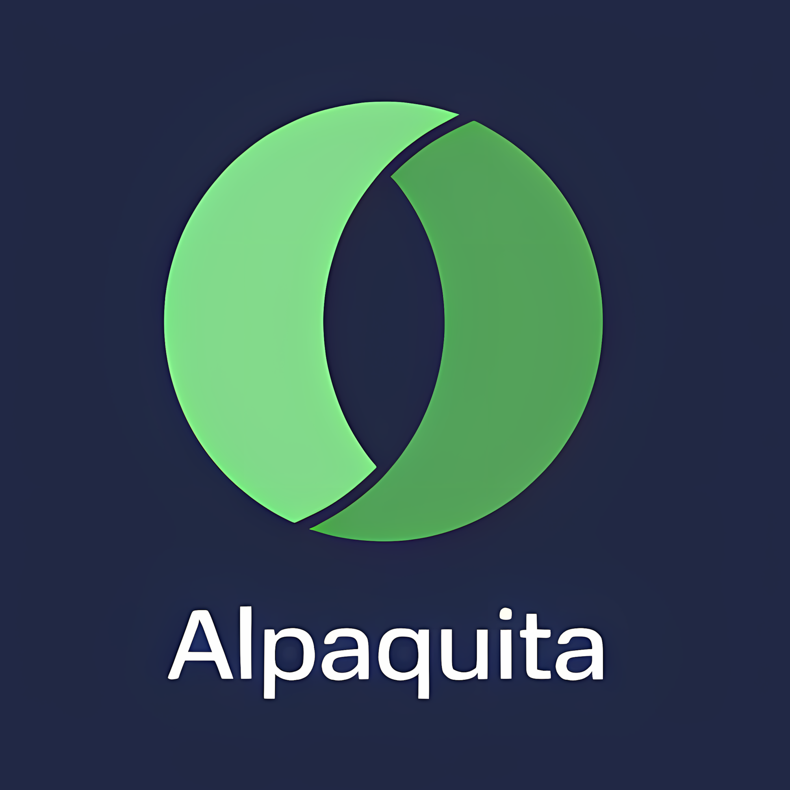

<div id="top"></div>

<!-- PROJECT SHIELDS -->
[![Contributors][contributors-shield]][contributors-url]
[![Forks][forks-shield]][forks-url]
[![Stargazers][stars-shield]][stars-url]
[![Issues][issues-shield]][issues-url]
[![MIT License][license-shield]][license-url]
[![LinkedIn][linkedin-shield]][linkedin-url]

<!-- PROJECT LOGO -->
<br />
<div align="center">
  <a href="[https://github.com/open-img-cloud/alpaquita-linux](https://github.com/open-img-cloud/alpaquita-linux)">
    
  </a>

<h3 align="center">Alpaquita Linux Cloud Images</h3>

  <p align="center">
    Optimized Alpaquita Linux images for OpenStack and Proxmox environments
    <br />
    <a href="https://github.com/open-img-cloud/alpaquita-linux"><strong>Explore the docs »</strong></a>
    <br />
    <br />
    <a href="https://github.com/open-img-cloud/alpaquita-linux/issues">Report Bug</a>
    ·
    <a href="https://github.com/open-img-cloud/alpaquita-linux/issues">Request Feature</a>
  </p>
</div>

<!-- ABOUT THE PROJECT -->
## About The Project

This project provides optimized Alpaquita Linux images specifically designed for cloud environments, including OpenStack and Proxmox platforms. Alpaquita Linux is a lightweight, security-focused distribution offering both glibc and musl libc variants.  

Our build process downloads the official Alpaquita Linux qcow2 images directly from [Bell-SW's repository](https://bell-sw.com/alpaquita-linux/) and customizes them using libguestfs tools (virt-customize) to ensure seamless cloud integration. The customization process includes:

- **Cloud-init integration:** Full cloud-init support with OpenStack and ConfigDrive datasources
- **Essential cloud packages:** Installation of cloud-init, qemu-guest-agent, SSH server, and network tools
- **Console access:** Serial console configuration for remote management
- **Service automation:** Automatic startup of essential services (SSH, DHCP, guest agent)
- **Storage optimization:** Image sparsification and compression for efficient deployment

### Key Features

- **Lightweight:** Minimal footprint optimized for cloud deployments
- **Security-focused:** Regular security updates and hardened configuration
- **Cloud-native:** Full cloud-init support for automated provisioning
- **Dual variants:** Available in both glibc and musl libc versions
- **Automated builds:** Images are automatically built and updated via GitHub Actions

### Update Schedule

Images are automatically built and released when new Alpaquita Linux versions are available from the official Alpaquita Linux repository ([glibc variant](https://packages.bell-sw.com/browse/alpaquita/glibc/stream/releases/x86_64/) and [musl variant](https://packages.bell-sw.com/browse/alpaquita/musl/stream/releases/x86_64/)). The CI/CD pipeline ensures fresh images with the latest security updates and cloud optimizations.

<p align="right">(<a href="#top">back to top</a>)</p>

## How to use this image

1. Set your OpenStack environment variables
2. Download the latest image from the [repository page](https://repo.openimages.cloud/alpaquita-linux/ "Images Repository")
3. Upload image to your OpenStack environment  

   **For GLIBC:**
   ```sh
   openstack image create --disk-format=qcow2 --container-format=bare --file alpaquita-<VERSION>-glibc-x86_64.qcow2  'Alpaquita Linux Stream (glibc)'
   ```
   **For MUSL:**
   ```sh
   openstack image create --disk-format=qcow2 --container-format=bare --file alpaquita-<VERSION>-musl-x86_64.qcow2  'Alpaquita Linux Stream (musl)'
   ```

<p align="right">(<a href="#top">back to top</a>)</p>

<!-- CONTRIBUTING -->
## Contributing

Contributions are what make the open source community such an amazing place to learn, inspire, and create. Any contributions you make are **greatly appreciated**.

If you have a suggestion that would make this better, please fork the repo and create a pull request. You can also simply open an issue with the tag "enhancement".
Don't forget to give the project a star! Thanks again!

1. Fork the Project
2. Create your Feature Branch (`git checkout -b feature/AmazingFeature`)
3. Commit your Changes (`git commit -m 'Add some AmazingFeature'`)
4. Push to the Branch (`git push origin feature/AmazingFeature`)
5. Open a Pull Request

<p align="right">(<a href="#top">back to top</a>)</p>


<!-- LICENSE -->
## License

Distributed under the GPL-2.0 License. See `LICENSE` for more information.

<p align="right">(<a href="#top">back to top</a>)</p>


<!-- CONTACT -->
## Contact

Kevin Allioli - [@NetArchitect404](https://x.com/NetArchitect404) - kevin@netarch.cloud

Project Link: [https://github.com/open-img-cloud/alpaquita-linux](https://github.com/open-img-cloud/alpaquita-linux)

<p align="right">(<a href="#top">back to top</a>)</p>


<!-- MARKDOWN LINKS & IMAGES -->
<!-- https://www.markdownguide.org/basic-syntax/#reference-style-links -->
[contributors-shield]: https://img.shields.io/github/contributors/open-img-cloud/alpaquita-linux.svg?style=for-the-badge
[contributors-url]: https://github.com/open-img-cloud/alpaquita-linux/graphs/contributors
[forks-shield]: https://img.shields.io/github/forks/open-img-cloud/alpaquita-linux.svg?style=for-the-badge
[forks-url]: https://github.com/open-img-cloud/alpaquita-linux/network/members
[stars-shield]: https://img.shields.io/github/stars/open-img-cloud/alpaquita-linux.svg?style=for-the-badge
[stars-url]: https://github.com/open-img-cloud/alpaquita-linux/stargazers
[issues-shield]: https://img.shields.io/github/issues/open-img-cloud/alpaquita-linux.svg?style=for-the-badge
[issues-url]: https://github.com/open-img-cloud/alpaquita-linux/issues
[license-shield]: https://img.shields.io/github/license/open-img-cloud/alpaquita-linux.svg?style=for-the-badge
[license-url]: https://github.com/open-img-cloud/alpaquita-linux/blob/master/LICENSE
[linkedin-shield]: https://img.shields.io/badge/-LinkedIn-black.svg?style=for-the-badge&logo=linkedin&colorB=555
[linkedin-url]: https://linkedin.com/in/kevinallioli
